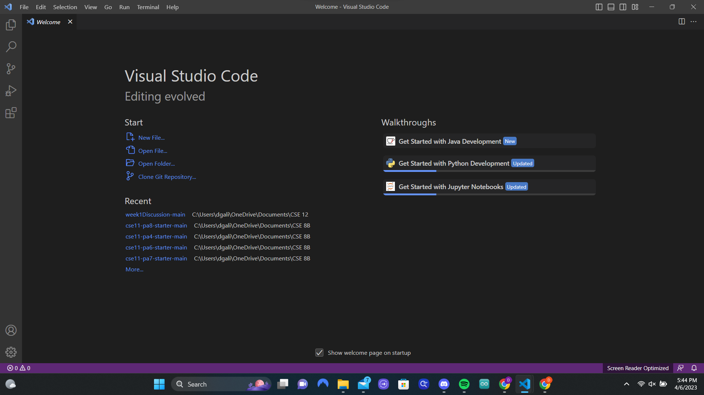
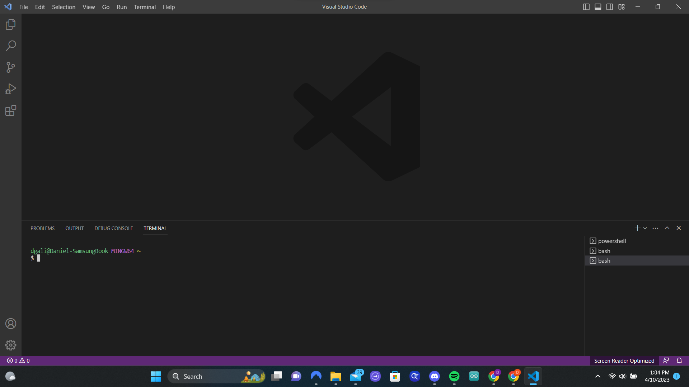
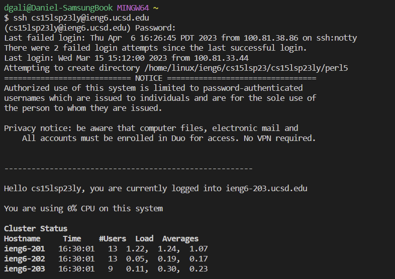

# Hello there
## Welcome to my first lab report 

We are going to today cover how to:
1) Install VS Code
2) How to remote connect to the UCSD servers
3) Try some commands

---
## Instaling the VS Code 

First of all you need to install the VS code programm on your computer, so follow this [link](https://code.visualstudio.com/download) Depending on your computer type, you will click a different button. In the end just follow along everything and don't worry about the other settings, just use the default settings and in the end when the program instals you will find yourself with an image such as this.

 > For me I had already installed this thats why my screen looks a bit more different from what a brand new program looks like



With that you are done with the first step, unfortunatly this is where things get overly complicated so pay attention

---

## Remote connecting 

Here comes the likely the most complicated part remote connecting, first we have getting your id for your email that will loke like this:
```
cs15lsp23**@ieng6.ucsd.edu 
```
The ** will be replaced with your ID but moving on. You will need to reset your password for that, instead of making my own tutorial here is one already made: [Tutorial](https://drive.google.com/file/d/17IDZn8Qq7Q0RkYMxdiIR0o6HJ3B5YqSW/view)
> You can get your specific ID by using the following [link](https://sdacs.ucsd.edu/~icc/index.php)

After there is another step for us windows users downloading git bash wich can be done at this [link](https://gitforwindows.org/)
After donloading that we can finally open it on vscode and open a terminal using Ctrl+Shift+` or using the terminal menu in vscode the en result is this
`


From there you shall need to input the following code:
```
ssh cs15lsp23**@ieng6.ucsd.edu 
```

the ** will be replaced with your ID

From there since it's the first time you loged in you will receive the following message

``` 
The authenticity of host 'ieng6.ucsd.edu (128.54.70.238)' can't be established.
RSA key fingerprint is SHA256:ksruYwhnYH+sySHnHAtLUHngrPEyZTDl/1x99wUQcec.
This key is not known by any other names.
Are you sure you want to continue connecting (yes/no/[fingerprint])?
```
Type yes and you will be asked for a password, which you should have already reseted and sfter inputing it, it's going to invisible you should get the following screen. 



**Congratulations** you have conected remotely!

---
## Runing Comands
After connecting we get to the fun part running some commands, some of the commands you can run are the following
```
cd ~
cd
ls -lat
ls -a
cat /home/linux/ieng6/cs15lsp23/public/hello.txt
```

> Note: To end the remote conection type, exit

As said before very fun here is a picture of my comand window running code

